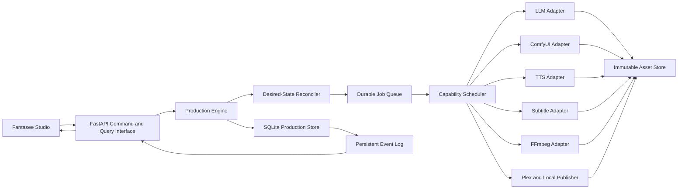
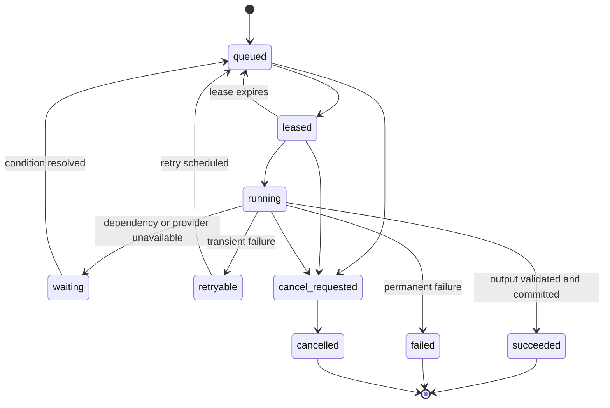

# Fantasee Studio Rebuild Plan

Status: Decision checkpoint 1 complete; implementation in progress

Created: 2026-07-17

Implementation method: Incremental strangler migration with vertical-slice TDD

## Implementation Checkpoint (2026-07-18)

The rebuild branch now has a working Studio shell at `/studio/` with durable
production runs, completion evidence, worker controls, semantic shot plans,
candidate approval, canonical timeline rendering, release records, historical
release preview, scene narration waveform inspection, keyboard-safe dialogs,
director presets, and scene-art-first library cards. The current evidence is
`194` passing Python tests, a passing Studio TypeScript/Vite build, and live
browser smoke checks against the local server. Remaining phases stay active:
enhanced creative tools, migration rehearsal, legacy parity review, and the
final end-to-end acceptance gate.

## 1. Executive Summary

Fantasee will evolve from a collection of capable generation and media scripts
behind a browser interface into a local-first AI animation studio with durable
production state, shot-level editing, worker scheduling, versioned creative
assets, a canonical media timeline, and verified releases.

This is not a big-bang rewrite. Existing story folders, playback, ComfyUI,
TTS, subtitle generation, FFmpeg rendering, and Plex export remain usable while
new modules replace orchestration one vertical capability at a time.

The central product contract is:

> A story is not done until every required story, shot, image, narration,
> subtitle, timeline, render, and release artifact is current and validated.

## 2. Will TDD Improve This Build?

Yes. TDD will be a major improvement if it is applied at stable public seams
and in vertical slices.

Fantasee's recurring failures are coordination failures:

- a queue says it is running but state is only in memory
- a file exists but contains invalid media
- an input changes but downstream media is not invalidated
- a repair path uses different rules from initial generation
- subtitles, player timing, rendering, and publishing disagree
- provider and process failures are difficult to reproduce

These behaviors are excellent TDD targets because they can be expressed as
deterministic contracts without invoking a paid API, GPU, or full render.

TDD should not attempt to prove that a nondeterministic model will create
beautiful art. It should prove that Fantasee:

- sends valid, model-appropriate requests
- records complete provenance
- rejects invalid output
- retries and resumes correctly
- invalidates the right dependencies
- preserves previous valid work on failure
- produces one coherent timeline
- never claims completion without evidence

The project will use one failing behavioral test, one minimal implementation,
and one vertical slice at a time. Large batches of speculative tests are not
the plan.

## 3. Goals

- Make every production and job durable across restarts.
- Make completion truthful, evidence-backed, and centrally defined.
- Introduce semantic shots instead of an arbitrary image count per scene.
- Regenerate only outputs affected by a revision.
- Make existing stories importable, editable, and reversible.
- Schedule CPU and GPU work by declared capability and health.
- Give users a coherent Library, Production Desk, Story Studio, and Player.
- Give creative agents structured roles without giving them ownership of state.
- Use one canonical timeline for playback, subtitles, rendering, and publishing.
- Support versioned edits, comparisons, locks, rollback, and alternate releases.
- Keep the default app local, understandable, and operable without cloud
  infrastructure.

## 4. Non-Goals for the Initial Rebuild

- Multi-tenant SaaS hosting
- Collaborative real-time editing between multiple users
- Training or fine-tuning foundation models
- Replacing ComfyUI, FFmpeg, or Whisper with custom inference engines
- Mobile-native applications
- A marketplace for styles, voices, or models
- Fully autonomous publishing without user-configurable approval rules
- Deleting existing story folders before migration and rollback are proven

These can be reconsidered after the production engine and studio are stable.

## 5. Current-State Findings

The current app has strong media capabilities but high orchestration coupling:

- The frontend is a single large HTML, CSS, and JavaScript document.
- Generation, repair, improvement, rendering, and publishing have overlapping
  orchestration paths.
- Running task state and story caching rely heavily on process-local globals.
- Story truth is spread across manifests, filenames, directories, status
  strings, task dictionaries, and generated media.
- Existing story manifests are useful but do not provide normalized revisions,
  dependency fingerprints, job leases, or asset provenance.
- Worker selection exists, but durable capability scheduling and ownership do
  not yet form a single module.
- The current test suite is valuable prior art, especially for story repair,
  media validation, subtitles, Plex, background tasks, and security.

The rebuild should deepen and consolidate existing behavior rather than layer
another orchestrator over it.

## 6. Proposed Product Model

### 6.1 Story

A Story stores creative intent and desired production requirements:

- concept, title, description, style, tone, audience, and duration target
- selected story-style version
- character and world bible
- scene order
- visual-density target
- release requirements
- current approved revision

### 6.2 Scene

A Scene stores a narrative unit:

- purpose and dramatic beat
- narrative and narration revisions
- continuity references
- ordered shot IDs
- performance direction
- scene-level completion requirements

### 6.3 Shot

A Shot is a visual beat, not merely an image slot:

- narrative purpose
- narration range or timeline range
- shot type, angle, composition, action, and setting
- character and world references
- prompt revision and negative prompt
- image-generation specification
- candidate assets and approved asset
- transition and duration
- lock state

### 6.4 Asset

An Asset is immutable media with validation and provenance:

- image, narration audio, music, subtitle data, poster, or video
- checksum and generation fingerprint
- provider, model, workflow, seed, and settings
- source revision IDs
- validation evidence
- storage path, dimensions or duration, and byte size

### 6.5 Production and Run

A Production declares desired state. A Run records one attempt to materialize a
command such as create, revise, repair, render, or publish.

### 6.6 Job and Worker

A Job is a durable executable step. A Worker declares capabilities, health,
resource kind, concurrency, and lease ownership.

### 6.7 Timeline and Release

The Timeline is the canonical edit decision list. A Release references an
approved timeline plus rendering and publishing settings.

## 7. Target Architecture



## 8. Technology Direction

These are the confirmed defaults for the first rebuild checkpoint:

| Area | Confirmed choice | Reason |
|---|---|---|
| Backend | Python, FastAPI, Pydantic | Preserve working media and provider code |
| Metadata | SQLite with WAL | Durable local operation without infrastructure |
| Mapping | SQLAlchemy 2.x plus Alembic | Explicit schema and reversible migrations |
| Media | Filesystem asset store | Large files remain inspectable and efficient |
| Queue | SQLite-backed jobs and leases | Restart-safe local queue without Redis |
| Frontend | React, TypeScript, Vite | Modular studio UI and typed contracts |
| Server state | Query projections and caches | Durable store remains authoritative |
| Events | Persisted events plus WebSocket delivery | Refresh and reconnect recovery |
| Tests | pytest plus browser tests | Existing Python strength plus critical UI flows |
| Browser tests | Playwright | Real production-desk and studio journeys |

## 9. Planned Deep Module Interfaces

The exact types will be finalized during implementation. The intended small
interfaces are:

### Production Engine

- Submit a production command and return a durable run identity.
- Inspect the current production projection.
- Reconcile desired and observed state.
- Request cancellation or retry.

### Production Store

- Execute transactional reads and writes through domain-oriented operations.
- Append and query durable production events.
- Lease and update jobs atomically.

### Asset Store

- Put a validated immutable asset.
- Open or locate an asset by identity.
- Verify integrity.

### Completion Verifier

- Evaluate a completion contract against a production projection.
- Return pass or fail plus structured evidence and repairable deficiencies.

### Timeline Engine

- Build a deterministic timeline from approved production inputs.
- Validate timing, coverage, ordering, and source freshness.

Provider details do not leak through these interfaces.

## 10. Durable Job State Machine



Jobs do not update completion directly. They commit validated outputs. The
reconciler and completion verifier derive production status from evidence.

## 11. Dependency and Invalidation Rules

Every derived record stores an input fingerprint. A fingerprint includes all
inputs that can change the output.

Examples:

| Changed input | Invalidated outputs |
|---|---|
| Story concept | Bible, outline, scenes, shots, all downstream media |
| Character appearance | Affected shot prompts and images, timeline renders, releases |
| Scene narration text | Narration audio, subtitles, timing, scene render, releases |
| Voice or speed | Narration audio, subtitles, timing, scene render, releases |
| Shot prompt | That shot's artwork, scene render, releases |
| Approved image | Timeline render and releases, not narration or subtitles |
| Subtitle alignment | Timeline captions, renders using captions, releases |
| Music selection | Timeline mix, full render, releases |
| Plex destination | Publishing job only |

Invalidated assets remain available for rollback but are not current.

## 12. Completion Evidence

The verifier should produce evidence such as:

```json
{
  "contract": "plex-release-v1",
  "passes": false,
  "checks": [
    {"name": "shots.have_approved_images", "passes": true},
    {"name": "narration.non_silent", "passes": true},
    {"name": "subtitles.cover_audio", "passes": false, "scene_id": "..."},
    {"name": "release.video_stream", "passes": true},
    {"name": "release.current", "passes": false}
  ]
}
```

The UI renders this evidence directly. It does not translate a generic
`incomplete` flag into invented explanations.

## 13. Creative Agent Contracts

### Writer

Inputs: creative intent, story-style version, bible revision, outline context.

Outputs: schema-validated bible, outline, scene, or revision proposal.

Quality: continuity, pacing, style compliance, and complete narrative beats.

### Director

Inputs: approved scene, bible, visual style pack, target visual density.

Outputs: ordered semantic shot specifications.

Quality: distinct purpose, action relevance, continuity, composition, and model
appropriate prompt length.

### Performance Director

Inputs: approved narration, character voices, tone, pronunciation dictionary.

Outputs: voice assignment and sentence or passage performance specification.

Quality: smooth pacing, restrained emotion by default, intelligibility, and
consistent voice identity.

### Producer

Inputs: desired production, observed state, completion evidence.

Outputs: reconciliation or repair proposal.

Quality: minimal affected scope, safe replacement, clear progress, and no hidden
degradation.

### Critic

Inputs: approved production and generated evidence.

Outputs: structured findings with severity, scope, evidence, and suggested
repair.

Quality: actionable findings, no unsupported aesthetic score, and no direct
mutation.

### 13.1 Granular LLM Production

The Writer and Critic do not receive a request such as "write the whole story
and make it production-ready." The engine commissions a sequence of bounded
deliverables. Each deliverable is validated, persisted as a revision, and made
available to the next call only after it passes its contract.

The default call ladder is:

1. Interpret creative intent and produce title and direction candidates.
2. Build the story bible in focused sections: cast, world, rules, conflicts,
   and continuity constraints.
3. Outline the story by arc or act.
4. Generate one scene card at a time from the approved outline and bible.
5. Generate or revise one scene's narration and dialogue.
6. Have the Director plan that scene's semantic shots and choose visual density
   from narration duration, pacing, and dramatic purpose.
7. Generate one shot prompt at a time with only relevant character, world, and
   neighboring-shot context.
8. Direct one scene's voice performance at a time.
9. Run continuity and style critics over bounded scene windows.
10. Revise only failed scenes, shots, or passages.

Each LLM call records:

- task type and output schema
- prompt-template revision
- bounded context references
- provider, model, temperature, token limits, and retry policy
- raw response location or redacted diagnostic reference
- normalized output and fingerprint
- validation and critic evidence

This creates higher-quality calls, smaller failure domains, better retries, and
more useful user controls. A complete production may involve many small calls,
but each call is understandable, testable, and independently replaceable.

Whole-story calls are allowed only as explicit experiments or provider-specific
shortcuts. They are not part of the default production contract.

### 13.2 Token Economics and Resolution

Granularity is a quality tool, not a reason to spend tokens without control.
The engine maintains a token ledger for every run and story:

- estimated tokens before submission
- reserved tokens while queued
- actual input and output usage when reported
- cached-token reuse where supported
- retry and escalation spend
- quality evidence associated with the spend

Each task receives a budget based on the size and complexity of its deliverable.
The initial values are configuration, not hard-coded assumptions. A scene may
legitimately receive a larger output budget, such as 4096 tokens, when its
characters, continuity, dialogue, or medical and technical detail require more
resolution. That budget is attached to the scene call, not wasted on a whole
story prompt that cannot use the same detail effectively.

The default budget policy is:

1. Start with the smallest budget likely to satisfy the output schema.
2. Validate structure, length, continuity, style, and usefulness.
3. Escalate only the failed deliverable when a real deficiency is found.
4. Send targeted feedback and bounded context on the retry.
5. Stop when the contract passes or the configured spend limit is reached.
6. Show the user why more tokens were requested and what improved.

The system must measure quality gained per additional token. A higher budget
becomes a default only when repeated evidence shows it improves the relevant
artifact. More calls are not inherently better; the goal is higher resolution
per useful token.

## 14. TDD Strategy

### 14.1 Proposed Test Seams

These seams require user confirmation before implementation begins:

1. Production Engine command and inspection interface
2. Production Store transaction and migration interface
3. Durable Queue lease, heartbeat, retry, priority, and cancellation interface
4. Asset Store put, retrieve, and verify interface
5. Adapter contract suites for LLM, ComfyUI, TTS, subtitles, FFmpeg, and Plex
6. Timeline Engine build and validation interface
7. Completion Verifier evidence interface
8. HTTP command and query interface
9. WebSocket event-recovery interface
10. Browser-level create, monitor, revise, play, repair, and publish journeys

### 14.2 Test Layers

| Layer | Purpose | Default dependencies |
|---|---|---|
| Domain behavior | State transitions, invalidation, completion | In-memory values |
| Module contract | Public module behavior | SQLite temp DB or deterministic fake |
| Adapter contract | Request mapping and response normalization | Recorded fixtures or local fake server |
| Integration | Store, queue, scheduler, and engine together | Temp SQLite and temp asset directory |
| Media smoke | FFprobe, tiny image/audio/video fixtures | Local FFmpeg, no model calls |
| Hardware smoke | One real image or narration job | Opt-in ComfyUI or provider |
| Browser journey | User-visible studio workflow | Local test server with fake adapters |

### 14.3 TDD Commit Rule

Each vertical capability should normally be one small commit containing its
behavioral test and minimal implementation. If preserving a visible red commit
is useful, use a two-commit pair only when the branch remains clearly marked as
work in progress.

## 15. Implementation Phases

### Phase 0: Safety, Decisions, and Characterization

Outcome: The current app has an explicit behavioral safety net and the first
architecture decisions are recorded. The new Studio remains an empty library;
the existing library is preserved separately.

Commit sequence:

1. Add the engineering contract and rebuild plan.
2. Add architecture-decision-record template and decision index.
3. Add test fixture factories for small stories and media.
4. Characterize current story discovery and manifest loading behavior.
5. Characterize current generation task events.
6. Characterize repair dependency behavior.
7. Characterize player, subtitle, render, and Plex timing assumptions.
8. Add a CI workflow for the deterministic test suite.
9. Add separate opt-in media and hardware test markers.

Acceptance gate:

- Architecture questions are resolved in ADRs.
- Existing deterministic tests pass in CI.
- Current manifests can be loaded by characterization fixtures.
- No production behavior has changed.

### Phase 1: Package Structure and Durable Store

Outcome: SQLite becomes the durable source of truth for new Studio productions,
without importing the existing story archive.

Commit sequence:

1. Introduce application configuration paths for data, database, and assets.
2. Add SQLite engine setup with WAL and foreign-key enforcement.
3. Add Alembic with an empty baseline migration.
4. Add story and scene identity tables.
5. Add revision tables and immutable revision rules.
6. Add production, run, and event tables.
7. Add job and job-dependency tables.
8. Add worker and worker-capability tables.
9. Add asset and asset-provenance tables.
10. Add timeline and release tables.
11. Implement the Production Store interface.
12. Add transaction rollback and restart tests.
13. Add an archive inventory command that reports legacy stories without
    importing them.
14. Add an explicit import-preview contract for a future feature.

Acceptance gate:

- A fresh database can be created and migrated forward and backward.
- Existing stories remain intact and are visible only through the current or
  legacy browser until a later import is explicitly requested.
- New Studio stories can be created in a clean database with no legacy rows.
- Restarting the server preserves production identities and events.

### Phase 2: Durable Runs, Events, and Queue

Outcome: A trivial background command survives restart and reports progress
through one durable task system.

Commit sequence:

1. Add run creation and inspection behavior.
2. Add append-only production events.
3. Add event cursor queries for reconnect recovery.
4. Add durable job enqueue behavior with idempotency keys.
5. Add atomic job leasing.
6. Add lease heartbeat and expiry recovery.
7. Add retry classification and backoff.
8. Add cooperative cancellation.
9. Add priority changes for queued jobs.
10. Add parent and child progress aggregation.
11. Add scheduler startup recovery.
12. Add token budget reservation and spend ledger behavior.
13. Add approved-context cache references to job inputs.
14. Project durable events over the current WebSocket interface.
15. Replace one low-risk background operation with the durable queue.
16. Add restart-during-job and reconnect-during-job browser tests.

Acceptance gate:

- Killing and restarting the server does not lose queued work.
- Expired work is safely retried without duplicate committed output.
- UI progress recovers after refresh.
- Token spend is visible, bounded, and not double-counted on retries.

### Phase 3: Immutable Assets and Provenance

Outcome: Generated and imported media is immutable, validated, fingerprinted,
and reusable.

Commit sequence:

1. Add generation fingerprint value object.
2. Add filesystem Asset Store implementation.
3. Add checksum verification.
4. Add atomic temporary-write promotion.
5. Add image validation evidence.
6. Add audio validation evidence.
7. Add subtitle validation evidence.
8. Add video stream validation evidence.
9. Add asset lookup by generation fingerprint.
10. Add stale and current dependency status.
11. Import legacy assets without moving files.
12. Add optional content-addressed promotion for newly generated assets.
13. Add garbage-collection preview that respects revisions and releases.

Acceptance gate:

- Failed replacement never removes the last valid asset.
- Same fingerprint can reuse a validated asset.
- Corrupt media is never approved or published.

### Phase 4: Production Engine and Adapter Seams

Outcome: One production command executes through typed adapters and durable
jobs without route-level orchestration.

Commit sequence:

1. Define typed adapter result and failure categories.
2. Add deterministic fake adapters for tests.
3. Wrap the current LLM call behind the LLM adapter.
4. Wrap ComfyUI submission and polling behind the image adapter.
5. Wrap TTS behind the narration adapter.
6. Wrap subtitle generation behind the alignment adapter.
7. Wrap FFmpeg behind the renderer adapter.
8. Wrap Plex copy and package behavior behind the publisher adapter.
9. Add Production Engine submit and inspect behavior.
10. Add desired-state reconciliation behavior.
11. Add dependency-aware job creation.
12. Add structured progress events.
13. Migrate one current generation endpoint to the engine behind a flag.

Acceptance gate:

- Routes contain transport handling, not pipeline rules.
- Default tests run entirely with deterministic fake adapters.
- Real adapters pass their contract suites.

### Phase 5: Story, Scene, Shot, and Revision Model

Outcome: Users can edit one semantic shot and regenerate only affected outputs.

Commit sequence:

1. Add story creative-intent revision behavior.
2. Add versioned story bible behavior.
3. Add ordered scene revisions.
4. Add semantic shot specification.
5. Add visual-density rules that produce a target shot range.
6. Add shot candidate and approval behavior.
7. Add lock behavior for text, voice, image, and timeline choices.
8. Add revision comparison behavior.
9. Add rollback behavior.
10. Add dependency invalidation from story to release.
11. Document a later opt-in archive import without making it part of the new
    Studio library.
12. Add revise-one-shot vertical API slice.
13. Add browser test proving unrelated scenes remain current.

Acceptance gate:

- One shot can be revised and regenerated independently.
- Locked assets are preserved.
- Rollback restores the prior approved dependency graph.

### Phase 6: Writer and Director Workflow

Outcome: Structured story development produces a bible, outline, scenes, and
purposeful shots.

Commit sequence:

1. Version the canonical story-style pack.
2. Add Writer bible schema and contract test.
3. Add focused title and creative-direction calls with response schemas.
4. Add Writer bible section calls for cast, world, rules, and conflicts.
5. Add Writer outline calls by arc or act.
6. Add Writer scene-card calls one scene at a time.
7. Add focused narration and dialogue calls per scene.
8. Add continuity context selection from approved neighboring revisions.
9. Add Director shot-plan schema and contract test.
10. Add Director density selection from narration duration and pacing.
11. Add shot-purpose and visual-distinctness validation.
12. Add model-aware prompt budget policy.
13. Add one-shot visual prompt calls with bounded context.
14. Add character and world reference resolution.
15. Add critic calls for bounded scene windows and targeted revisions.
16. Add approval gates for bible, scenes, and shot plans.
17. Add create-story vertical slice through the granular call ladder.
18. Add budget-escalation tests showing that only failed deliverables receive
    additional tokens.

Acceptance gate:

- No brittle prose parser is required for primary creative outputs.
- Every planned shot has a distinct narrative purpose.
- Prompts fit the selected image model's effective limits.
- No default LLM call owns an entire story.
- A failed scene or shot call can be retried without rewriting approved work.
- A larger scene budget improves a measured quality or completeness failure.

### Phase 7: Worker Registry and Image Production

Outcome: Multiple CPU and GPU workers process distinct compatible jobs safely.

Commit sequence:

1. Add worker registration and capability heartbeat.
2. Add ComfyUI worker discovery adapter.
3. Add explicit CPU, GPU, device, and model capabilities.
4. Add health and circuit-breaker behavior.
5. Add capability-aware scheduling.
6. Add per-device concurrency limits.
7. Add spawn command behavior with process identity.
8. Add stop-selected-worker behavior.
9. Add worker logs and queue-depth projection.
10. Add image candidate generation job.
11. Add blank, duplicate, relevance, and dimension validation hooks.
12. Add candidate approval and replacement safety.
13. Add Production Desk worker-lane UI.

Acceptance gate:

- CPU and GPU can process different jobs concurrently when configured.
- A stopped worker's lease recovers safely.
- Invalid images never enter the approved timeline.

### Phase 8: Performance, Audio, Subtitles, and Timeline

Outcome: Narration, subtitles, images, and transitions share exact timing.

Commit sequence:

1. Add voice profile and casting revision behavior.
2. Add pronunciation dictionary behavior.
3. Add performance direction schema.
4. Add narration speed and emotion parameters.
5. Add narration synthesis job.
6. Add silence, clipping, loudness, and duration validation.
7. Add subtitle alignment job tied to exact audio fingerprint.
8. Add subtitle coverage and bounds validation.
9. Add shot-to-narration range assignment.
10. Add deterministic Timeline Engine.
11. Add transition and music track model.
12. Add player projection from the canonical timeline.
13. Add browser synchronization test using deterministic media.

Acceptance gate:

- Changing voice speed invalidates and rebuilds audio, subtitles, timing, render,
  and releases.
- Player and timeline tests agree on shot and subtitle timing.

### Phase 9: Rendering, Releases, and Completion

Outcome: Draft and Plex releases are reproducible, validated, and current.

Commit sequence:

1. Add render specification and fingerprint.
2. Render one scene from a timeline slice.
3. Render a full timeline.
4. Generate chapters from scene boundaries.
5. Generate subtitle sidecars from the timeline.
6. Generate poster and release metadata.
7. Add local release publisher.
8. Add Plex publisher.
9. Add release destination validation and safe paths.
10. Add Completion Verifier checks incrementally.
11. Add repair proposal generation from failed evidence.
12. Add publish command that refuses incomplete dependencies.
13. Add complete production hardware smoke test.

Acceptance gate:

- FFprobe confirms expected video and audio streams.
- A stale source prevents publishing.
- The completion verifier is the only authority that marks a release complete.

### Phase 10: Fantasee Studio Frontend

Outcome: The modular frontend replaces the single-file interface without losing
existing user workflows.

Commit sequence:

1. Scaffold React, TypeScript, and Vite beside the current UI.
2. Generate or hand-maintain typed client contracts.
3. Add application shell and routing.
4. Add durable event and query client.
5. Add the Library view.
6. Add truthful completion badges and evidence panel.
7. Add the Production Desk.
8. Add worker management modal and lanes.
9. Add Story Studio storyboard.
10. Add shot detail and candidate comparison.
11. Add narration waveform and subtitle editor.
12. Add revision history and rollback UI.
13. Add canonical-timeline Player.
14. Add create flow and mood-board seed picker.
15. Add unified notifications and task panel.
16. Add accessibility and keyboard navigation tests.
17. Switch the default route behind a feature flag.
18. Remove the legacy UI only after parity approval.

Acceptance gate:

- Critical Playwright journeys pass.
- Refreshing during work restores task state.
- No duplicate progress UI exists.
- User approves feature parity and visual direction.

### Phase 11: Enhanced Creative Features

Outcome: Fantasee becomes more powerful and enjoyable after the reliable core
is complete.

Candidate vertical slices:

1. Voice audition and casting room.
2. Mood-board and reference-image library.
3. Character appearance locks and reference adapters.
4. Style packs with model, workflow, prompt, and color direction.
5. Side-by-side shot auditions.
6. Alternate ending branches.
7. Short, cinematic, audiobook, trailer, and Plex release editions.
8. Automatic trailers, posters, thumbnails, and credits.
9. Remix controls for tone, pace, intimacy, humor, and strangeness.
10. Director presets and reusable production templates.

Each feature requires its own completion contract and rollback behavior.

### Phase 12: Migration Completion and Cleanup

Outcome: The new production engine and studio are authoritative, with proven
rollback and no duplicate orchestration.

Commit sequence:

1. Add migration readiness report.
2. Run dry-run migration against every local story.
3. Back up and migrate selected pilot stories.
4. Verify playback and releases against current outputs.
5. Migrate the remaining library with resumable progress.
6. Keep a read-only legacy compatibility window.
7. Remove legacy write paths.
8. Remove legacy task dictionaries and duplicated orchestration.
9. Remove the legacy frontend.
10. Archive obsolete scripts with a migration note.
11. Update public documentation and release notes.
12. Tag the first production-ready Studio release.

Acceptance gate:

- Every story has migration evidence or an explicit exception.
- Rollback has been exercised.
- No production request reaches a legacy write path.

## 16. Frontend Product Specification

### Library

- newest-first story cards using real scene art
- readiness, production, attention, and published states
- runtime, scene count, progress, and continue-watching position
- search, filter, sort, archive, and restore

### Production Desk

- persistent queue and production timeline
- CPU and GPU worker lanes
- current operation, waiting reason, progress, and estimated range
- retry, cancel, reprioritize, pause admission, and stop worker
- direct navigation from a failed job to the affected scene or shot

### Story Studio

- horizontal scene and shot storyboard
- script, prompt, image candidates, audio waveform, subtitles, and status
- drag ordering with explicit downstream invalidation preview
- regenerate, compare, approve, lock, revise, branch, and rollback
- completion evidence and repair proposal

### Player

- canonical timeline playback
- precise subtitles and optional word highlighting
- narration and music controls
- chapters, scenes, shots, and revision selection
- draft and release edition switching

## 17. Observability

The app should answer these questions without opening a terminal:

- What is happening now?
- What is waiting, and why?
- Which worker owns the job?
- What was attempted?
- What failed, and is it retryable?
- What changed when a repair ran?
- Why is this story incomplete?
- Which output is stale?
- How long did comparable jobs take?

Persist structured events and retain bounded diagnostic logs. Do not stream raw
provider secrets or entire prompts to public UI by default.

## 18. Security and Public Repository Readiness

- Keep safe loopback defaults.
- Store secrets outside version control.
- Add secret scanning and dependency auditing to CI.
- Validate every external URL and redirect.
- Validate story IDs and storage paths.
- Use argument arrays for processes, never untrusted shell strings.
- Treat FFmpeg metadata and subtitle text as untrusted.
- Add migration tests for malicious filenames and manifests.
- Exclude generated media, local databases, models, logs, and transcripts.

## 19. Rollout Strategy

Use feature flags and small pull requests into the rebuild branch, followed by a
final review pull request into `main`. Do not import the current story library
as part of the first Studio release.

Recommended sequence:

1. Legacy app reads legacy stories as today.
2. New Studio initializes an empty managed library.
3. One vertical command writes through the new engine.
4. More commands move after parity and restart tests pass.
5. Small phase pull requests merge into the rebuild branch.
6. A final rebuild pull request targets `main` after acceptance gates pass.
7. A later, explicit archive-import project may migrate selected stories.
8. Legacy code is removed only after rollback approval.

## 20. Major Risks and Mitigations

| Risk | Mitigation |
|---|---|
| Rewrite stalls before user value | Ship vertical slices and keep current app usable |
| Database and files disagree | Transactions, fingerprints, reconciliation, atomic promotion |
| Too many abstractions | Add seams only where variation exists and test through small interfaces |
| Agent complexity explodes | Keep five deep roles with structured outputs |
| Hardware tests are slow | Deterministic fakes by default and opt-in smoke suites |
| Migration loses media | Read-only import, backup, dry run, checksum, rollback rehearsal |
| UI becomes another monolith | Feature modules, typed contracts, and browser journey tests |
| Queue duplicates expensive work | Leases, idempotency keys, and output fingerprints |
| Visual quality remains inconsistent | Reference locks, candidate approval, model-aware prompts, critic evidence |

## 21. Confirmed Decisions

The first decision checkpoint established the following:

1. The initial platform is Windows-first, with portable adapter interfaces for
   later cross-platform work.
2. Autopilot is configurable. Users may set approval gates and lock creative
   decisions rather than choosing between forced manual work and blind autonomy.
3. Delivery uses small pull requests into `codex/fantasee-studio-rebuild`, then
   one final pull request into `main`.
4. The first implementation milestone is durable queue state, restart recovery,
   persistent events, and truthful progress.
5. The new Studio starts with a clean library. Existing stories remain archived
   and are not imported or deleted by the rebuild.
6. The new Studio frontend will use React, TypeScript, and Vite.
7. SQLite is the only required metadata database for the first production
   release.
8. The Director chooses shot density from narration, pacing, and scene purpose.
9. LLM production uses many smaller, higher-quality calls with bounded context,
   schemas, validation, and targeted revision rather than one whole-story call.

## 22. Remaining Decisions Requiring User Confirmation

1. Whether the first enhanced release prioritizes Story Studio editing, maximum
   unattended production, or worker throughput.
2. Whether the initial voice system remains narrator-only or introduces a cast
   of character voices in the core rebuild.
3. Which proposed public test seams are approved for TDD.

## 23. Immediate Next Actions After Decisions

1. Record confirmed choices as ADRs.
2. Confirm the TDD seams.
3. Convert Phase 0 into issues or milestones.
4. Add CI and deterministic fixture factories.
5. Build the first vertical tracer slice: durable run creation, persisted event,
   restart recovery, and UI progress restoration through fake adapters.

That tracer slice should prove the architecture before any provider or media
pipeline is migrated.
